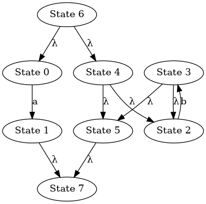
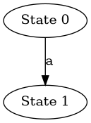
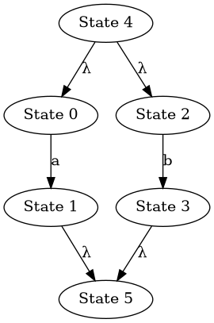

# **NFA Translator with Thompson's Construction**



This project implements a **Non-deterministic Finite Automaton (NFA) Translator** with λ-transitions using **Thompson's Construction**. The program reads regular expressions in infix notation, converts them to postfix using the **Shunting Yard Algorithm**, and constructs NFAs that are visualized as graphs.

The translator can process both simple and complex regular expressions, generating precise NFAs with λ-transitions. It provides visual insights into how regular expressions translate into state machines, offering a practical tool for both learning and testing automata theory concepts.

---

## **Features**

- **Infix to Postfix Conversion:** Uses the Shunting Yard algorithm to convert regular expressions from infix to postfix notation, handling operator precedence and associativity.
- **Thompson's Construction:** Builds NFAs from postfix regular expressions with λ-transitions, accurately representing operations like union, concatenation, and Kleene star.
- **Graph Visualization:** Automatically generates and saves NFA graphs as PNG files using Graphviz, making it easier to visualize the automaton structure.
- **Error Handling:** Detects syntax errors in regular expressions, such as unmatched parentheses, missing operands, or incorrect operator usage.
- **Batch Processing:** Processes multiple regular expressions in one run and generates corresponding NFAs, displaying transitions and saving visual outputs.
- **Complex Expression Support:** Handles nested expressions, multiple unions, concatenations, and iterations, providing robust support for advanced regex patterns.

---

## **How It Works**

1. **Infix to Postfix Conversion:**
    - The program first adds explicit concatenation operators (`.`) where needed in the infix expression.
    - It validates the expression for common syntax errors, ensuring correct operator usage and balanced parentheses.
    - Converts the validated infix expression into postfix notation using the Shunting Yard algorithm.

2. **NFA Construction:**
    - Using Thompson's construction algorithm, the program builds an NFA from the postfix expression.
    - λ-transitions are introduced for union (`|`), concatenation (`.`), and Kleene star (`*`) operations.
    - Each symbol and operation is translated into a finite automaton structure, with unique states and transitions.

3. **Graph Generation:**
    - The constructed NFA is visualized using Graphviz.
    - The program generates PNG images of each NFA, saved in the `graphs/` directory with names like `afn_graph_1.png`, `afn_graph_2.png`, etc.
    - Transitions and state connections are clearly labeled in the graph for easy interpretation.

4. **Output Logging:**
    - All processed expressions, corresponding postfix notations, and transitions are logged in `output.txt` for review.
    - Errors encountered during processing are also logged, helping identify problematic regular expressions.

---

## **Example Output**

### **Example 1: Simple Symbol**

- **Infix Expression:** `a`
- **Postfix Expression:** `a`

The NFA consists of two states with a single transition labeled `a`.

**Generated NFA Graph:**



---

### **Example 4: Concatenation**

- **Infix Expression:** `ab`
- **Postfix Expression:** `ab.`

This NFA represents the concatenation of `a` followed by `b`, with λ-transitions connecting the two symbols.

**Generated NFA Graph:**


---

### **Example 5: Union**

- **Infix Expression:** `a|b`
- **Postfix Expression:** `ab|`

The NFA branches from an initial state into two parallel paths, one for `a` and one for `b`, before converging at a final state.

**Generated NFA Graph:**



---

### **Example 7: Kleene Star**

- **Infix Expression:** `a*`
- **Postfix Expression:** `a*`

This NFA allows for zero or more repetitions of the symbol `a`, with λ-transitions enabling looping.

**Generated NFA Graph:**


---

### **Example 22: Syntax Error**

- **Infix Expression:** `a|`
- **Error:** `Expression ends with an operator: '|'.`

The program correctly identifies and reports the syntax error, preventing the construction of an invalid NFA.

---

## **File Structure**

```
.
├── graphs/                 # Folder containing generated NFA graphs (PNG files)
├── main.py                 # Main script to process regular expressions and build NFAs
├── output.txt              # Output log of processed regular expressions and results
├── tempCodeRunnerFile.py   # Temporary file for quick testing
└── README.md               # Project documentation
```

- **`graphs/`**: Stores all generated NFA graphs.
- **`main.py`**: Core script handling input processing, conversion, and graph generation.
- **`output.txt`**: Contains logs of expressions processed, their postfix forms, transitions, and errors.
- **`tempCodeRunnerFile.py`**: Auxiliary file possibly used for debugging or quick code tests.
- **`README.md`**: Documentation detailing project functionality, features, and examples.

---

## **License**

This project is licensed under the [MIT License](LICENSE).

---

## **Additional Insights**

This project not only demonstrates the practical application of Thompson's construction for NFAs but also serves as an educational tool for understanding automata theory. By visualizing how regular expressions are translated into finite state machines, users can gain a deeper comprehension of theoretical computer science concepts.

The batch processing feature allows for extensive testing of regular expressions, while the error handling mechanisms ensure robustness and clarity in processing invalid inputs. The integration of Graphviz for visualization makes it easier to interpret the structure of NFAs, aiding both students and professionals in learning and applying automata principles.

Complex expressions involving nested unions, multiple concatenations, and iterative patterns are accurately processed, showcasing the flexibility and power of the implemented algorithms.
# NFA-Translator-with-Thompson-s-Construction

